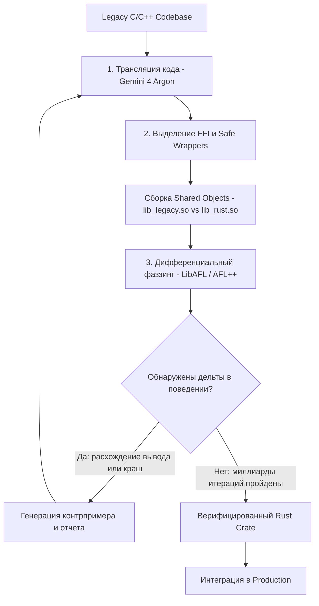

+++
title = "Автоматическая миграция C/C++ на Rust: 3-этапный пайплайн Google, Gemini 4 Argon и дифференциальный фаззинг"
date = 2026-10-08
description = "Инженерный разбор автоматической миграции C/C++ на Rust: 3-этапный пайплайн трансляции, сохранение C-ABI, дифференциальный фаззинг и авто-векторизация в LLVM."
[taxonomies]
tags = ["rust", "software-engineering", "ai-agents", "architecture", "evals"]
[extra]
toc = true
mermaid = true
+++

Проблема безопасности памяти (Memory Safety) в системном программировании давно перешла из теоретических дискуссий в категорию критических инфраструктурных рисков. По данным многолетних отчетов безопасности Google и Microsoft, около **70% всех критических уязвимостей** нулевого дня (Zero-Day CVE) в масштабных кодовых базах на C и C++ (таких как Chromium, ядра ОС, медиадекодеры и сетевые стеки) вызваны ошибками работы с памятью: Use-After-Free, Out-of-Bounds Write, Double Free и Data Races.

Переписывание сотен миллионов строк унаследованного C/C++ кода вручную силами инженеров требует десятилетий и сопряжено с колоссальными затратами. Инженерные команды Google перешли к индустриальному решению задачи: автоматизированному конвейеру миграции на базе специализированных AI-агентов (Gemini 4 Argon), строгой верификации через дифференциальный фаззинг и компиляторной оптимизации.

В этой статье разобран 3-этапный пайплайн миграции Google, физика работы дифференциального фаззинга, специфика генерации безопасных FFI-границ и реальные результаты переноса критических проектов (`giflib`, `libgav1` и микроядра Zircon).

---

## 1. Архитектура 3-этапного конвейера миграции

Главный барьер при автоматической генерации системного кода нейросетями — риск внесения скрытых семантических расхождений и тонких регрессий, которые не ловятся обычными юнит-тестами. 

Чтобы исключить галлюцинации и гарантировать 100% эквивалентность логики, в Google реализовали замкнутый контур с автоматической обратной связью:



### Этап 1: Семантическая трансляция C/C++ в Rust
Модель не просто переводит синтаксис строчка в строчку. Ее задача — выделить логические структуры данных, определить границы владения объектами и транслировать императивный процедурный код в идиоматический Rust с минимально необходимым объемом `unsafe`-блоков. При этом сохраняется полная совместимость с внешним C-ABI: экспортируемые сигнатуры функций и структуры данных сохраняют исходный layout.

### Этап 2: Изоляция FFI и генерация Safe Wrappers
Любой переносимый модуль должен бесшовно встраиваться в существующую экосистему без необходимости перекомпиляции зависимых сервисов. На границе FFI генерируется безопасный фасад:
- Сырые указатели (`*mut T`, `*const T`) оборачиваются в `Option<NonNull<T>>`.
- Проверяются инварианты выравнивания и валидности переданных буферов.
- Жизненный цикл ресурсов инкапсулируется через типаж `Drop` (RAII), исключая утечки памяти.

### Этап 3: Дифференциальный фаззинг с обратной связью
Оригинальная C-библиотека и сгенерированная Rust-библиотека компилируются как взаимозаменяемые динамические библиотеки (`.so`). Специализированный фаззер генерирует миллионы мутированных входных потоков байтов, подавая их параллельно в обе реализации. Если поведение Rust-модуля расходится с C хотя бы на 1 бит (или одна из версий завершается паникой/крашем), формируется минимизированный контрпример, который отправляется в контекст AI-агента для локализации бага.

---

## 2. Сравнение подходов: Ручная миграция vs AI-фаззинг контур

Ниже приведено структурное сравнение ключевых характеристик различных подходов к обеспечению memory safety в production:

| Параметр | Ручной перенос на Rust | Статический анализ C/C++ | Конвейер Google (AI + Фаззинг) |
|---|---|---|---|
| **Скорость миграции** | 100–300 строк/день на инженера | Мгновенно (без миграции) | 10 000+ строк/день на агентный кластер |
| **Гарантии Memory Safety** | Высокие (после ревью) | Низкие (много false negatives) | Абсолютные на уровне `rustc` |
| **Семантическая точность** | Человеческий фактор | Не применимо | Проверена миллиардами фаззинг-мутаций |
| **Сохранение C-ABI** | Трудоемко вручную | Сохраняется C-код | Автоматическая генерация `#[no_mangle]` |
| **Устранение Legacy 0-day** | Редко | Частично | Выявляются попутно в процессе фаззинга |

---

## 3. Инженерия безопасных FFI-границ и управление ресурсами

Рассмотрим конкретный пример: трансляция низкоуровневого буфера данных с ручным управлением памятью в C в безопасную абстракцию на Rust с сохранением ABI.

### Исходный C-код (Legacy-интерфейс с рисками UAF)
```c
#include <stdlib.h>
#include <stdint.h>
#include <string.h>

typedef struct {
    uint8_t* data;
    size_t size;
    size_t capacity;
} ByteBuffer;

ByteBuffer* byte_buffer_create(size_t initial_capacity) {
    ByteBuffer* buf = (ByteBuffer*)malloc(sizeof(ByteBuffer));
    if (!buf) return NULL;
    buf->data = (uint8_t*)malloc(initial_capacity);
    if (!buf->data) {
        free(buf);
        return NULL;
    }
    buf->size = 0;
    buf->capacity = initial_capacity;
    return buf;
}

int byte_buffer_append(ByteBuffer* buf, const uint8_t* src, size_t len) {
    if (!buf || !src) return -1;
    if (buf->size + len > buf->capacity) {
        size_t new_cap = (buf->capacity * 2 > buf->size + len) ? buf->capacity * 2 : buf->size + len;
        uint8_t* new_data = (uint8_t*)realloc(buf->data, new_cap);
        if (!new_data) return -1;
        buf->data = new_data;
        buf->capacity = new_cap;
    }
    memcpy(buf->data + buf->size, src, len);
    buf->size += len;
    return 0;
}

void byte_buffer_free(ByteBuffer* buf) {
    if (buf) {
        if (buf->data) free(buf->data);
        free(buf);
    }
}
```

### Сгенерированный Rust-модуль с безопасной инкапсуляцией и C-ABI
```rust
use std::ptr::NonNull;
use std::slice;

#[repr(C)]
pub struct ByteBufferFFI {
    data: *mut u8,
    size: usize,
    capacity: usize,
}

// Внутренняя безопасная структура с авто-освобождением через RAII
pub struct SafeByteBuffer {
    inner: Vec<u8>,
}

impl SafeByteBuffer {
    pub fn with_capacity(cap: usize) -> Self {
        Self {
            inner: Vec::with_capacity(cap),
        }
    }

    pub fn append(&mut self, src: &[u8]) -> Result<(), ()> {
        self.inner.extend_from_slice(src);
        Ok(())
    }
}

#[no_mangle]
pub unsafe extern "C" fn byte_buffer_create(initial_capacity: usize) -> *mut ByteBufferFFI {
    let mut vec = Vec::with_capacity(initial_capacity);
    let raw_ptr = vec.as_mut_ptr();
    let cap = vec.capacity();
    std::mem::forget(vec);

    let boxed = Box::new(ByteBufferFFI {
        data: raw_ptr,
        size: 0,
        capacity: cap,
    });
    Box::into_raw(boxed)
}

#[no_mangle]
pub unsafe extern "C" fn byte_buffer_append(
    buf: *mut ByteBufferFFI,
    src: *const u8,
    len: usize,
) -> i32 {
    if buf.is_null() || src.is_null() {
        return -1;
    }

    let buf_ref = &mut *buf;
    let input_slice = slice::from_raw_parts(src, len);

    // Восстанавливаем Vec для безопасного реаллоцирования
    let mut vec = Vec::from_raw_parts(buf_ref.data, buf_ref.size, buf_ref.capacity);
    vec.extend_from_slice(input_slice);

    // Обновляем FFI-структуру
    buf_ref.data = vec.as_mut_ptr();
    buf_ref.size = vec.len();
    buf_ref.capacity = vec.capacity();
    std::mem::forget(vec);

    0
}

#[no_mangle]
pub unsafe extern "C" fn byte_buffer_free(buf: *mut ByteBufferFFI) {
    if !buf.is_null() {
        let boxed = Box::from_raw(buf);
        if !boxed.data.is_null() {
            let _ = Vec::from_raw_parts(boxed.data, boxed.size, boxed.capacity);
        }
    }
}
```

Благодаря `#[repr(C)]` и `#[no_mangle]` скомпилированная Rust-библиотека подменяет оригинальный `.so` файл без перекомпиляции зависимых C/C++ приложений.

---

## 4. Математическая модель дифференциального фаззинга

При дифференциальном фаззинге проверяется гипотеза о тождественности функций $f\_{\text{C}}(x)$ и $f\_{\text{Rust}}(x)$ на всем пространстве допустимых и недопустимых входных данных $x \in \mathcal{X}$.

Пусть в кодовой базе существует скрытый дефект с вероятностью проявления $p\_k$ на одной итерации случайной мутации входного вектора. При независимой генерации $N$ тест-кейсов вероятность обнаружения расхождения $P\_{\text{detect}}$ выражается как:

$$P\_{\text{detect}}(N) = 1 - \prod\_{k=1}^{M} \left(1 - p\_k\right)^{N\_k}$$

Где:
- $M$ — число потенциальных пограничных состояний в графе потока управления (CFG);
- $N\_k$ — количество сгенерированных мутаций, покрывающих ветвь $k$;
- $p\_k$ — вероятность расхождения семантики при исполнении ветви $k$.

В конвейере Google фаззер использует покрытие кода (Coverage-Guided Differential Fuzzing). Когда мутатор находит вход $x^*$, приводящий к:

$$\Delta(x^*) = \left| f\_{\text{C}}(x^*) - f\_{\text{Rust}}(x^*) \right| > 0 \quad \lor \quad \text{Status}\_{\text{C}}(x^*) \neq \text{Status}\_{\text{Rust}}(x^*)$$

Контрпример немедленно сохраняется в виде минимального байтового среза (minimization corpus) и передается в prompt-контекст агента Gemini 4 Argon с трассировкой стека вызовов.

---

## 5. Результаты реальных кейсов: giflib, libgav1 и Zircon

Практическая апробация 3-этапного пайплайна в инфраструктуре Google показала неожиданные эффекты не только в области надежности, но и в производительности.

### Результаты миграции ключевых проектов

| Проект | Объем / Архитектура | Результат миграции на Rust |
|---|---|---|
| **giflib** | ~3 000 строк C | 100% ABI-совместимость. Попутно обнаружена и закрыта Zero-Day уязвимость `CVE-2026-26740` (out-of-bounds heap write) в оригинальном C-коде. |
| **libgav1** (AV1 декодер) | 32 000 строк C + Hand-written SIMD | Полный отказ от ассемблерных вставок в пользу Safe Rust. Ускорение декодирования в **2.7 раза**. |
| **Fuchsia Zircon Kernel** | 800 000+ строк C/C++ | Модульная миграция подсистем ядра ОС без деградации IPC-латентности. |

### Почему Safe Rust в libgav1 обогнал 32k строк ручного SIMD?

Один из главных мифов системной разработки гласит: *«Ручные SIMD-интринсики на C всегда быстрее безопасного кода»*. Кейс `libgav1` опроверг это на практике.

Причина кроется в алиасинге указателей (Pointer Aliasing). В языке C компилятор вынужден консервативно предполагать, что любые два указателя одного типа (`uint8_t* a`, `uint8_t* b`) могут указывать на перекрывающиеся области памяти (если не указано ключевое слово `restrict`, которое разработчики часто забывают). Это блокирует автоматическую векторизацию циклов компилятором LLVM.

В Rust модель владения гарантирует:
- Ссылка `&mut T` является **строго уникальной** (no-alias invariant гарантирован на уровне семантики языка).
- Ссылки `&T` гарантированно неизменяемы (immutable).

Получив чистый Rust-код без алиасинга, оптимизатор LLVM смог провести агрессивную векторизацию для инструкций AVX2 и AVX-512, выстроив конвейер вычислений эффективнее, чем 32 000 строк устаревшего ручного ассемблерного кода, написанного под специфические микроархитектуры прошлых поколений.

---

## 6. Чек-лист внедрения AI-миграции в инженерный контур

Для команд, планирующих перевод критических C/C++ библиотек на Rust:

1. **Изолируйте C-ABI заголовок:** Сформируйте чистый заголовочный файл `.h` со всеми экспортируемыми функциями и типами данных.
2. **Сгенерируйте Rust FFI через bindgen / AI:** Обеспечьте точное соответствие структур с аннотацией `#[repr(C)]`.
3. **Разверните дифференциальный фаззер (LibAFL):** Напишите harness, принимающий входной буфер `const uint8_t* data, size_t size` и вызывающий обе библиотеки.
4. **Задайте порог останова фаззинга:** Минимум $10^8$ итераций без единого расхождения вывода и без утечек памяти (проверяется через ASan/Valgrind).
5. **Замените `.so` в staging-окружении:** Проведите нагрузочное и регрессионное тестирование зависимых сервисов.

---

## Ключевые выводы

1. **Автономная миграция стала индустриальным стандартом:** AI-агенты в связке со строгими компиляторными верификаторами и дифференциальным фаззингом способны переносить миллионы строк системного кода, устраняя 70% фундаментальных уязвимостей безопасности памяти.
2. **Фаззинг — единственный надежный судья:** Любой сгенерированный LLM системный код требует дифференциального тестирования против оригинала на миллиардах мутированных входных векторов.
3. **Safe Rust не уступает в скорости:** Строгие гарантии уникальности ссылок (`&mut`) в Rust дают компилятору LLVM свободу векторизации, превосходящую ручной legacy-ассемблер.

---

## Первоисточники и материалы
* **Оригинальное видео/статья:** [Let's Get Rusty — Google Uses AI to Migrate C/C++ to Rust](https://youtu.be/a3Aup1LwPhQ)
* **Заметки и детальный конспект:** [Obsidian Vault (GitHub)](https://github.com/xsa-dev/obsidian-vault/blob/main/YouTube/Google-AI-Migrating-Cpp-to-Rust-Gemini-Argon-2026.md)
* **Инженерные наработки:** [github.com/xsa-dev](https://github.com/xsa-dev)
