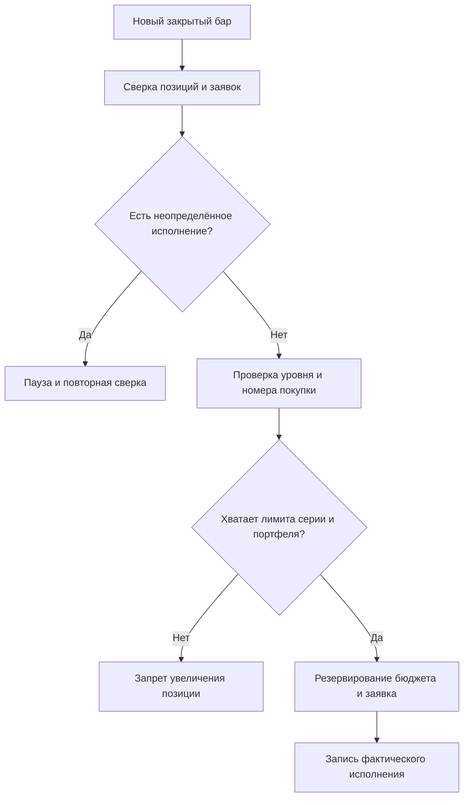

+++
title = "Бюджет и риск-гейты для DCA-позиций: расчёт до запуска бота"
date = 2026-10-09
description = "Инженерный расчёт бюджета DCA-позиции: геометрия покупок, средняя цена, резервы, частичные исполнения и проверка бэктеста."
[taxonomies]
tags = ["algo-trading", "quantitative", "software-engineering", "high-risk"]
[extra]
toc = true
mermaid = true
katex = true
+++

Усреднение снижает цену безубыточности, но одновременно увеличивает сумму под риском. **Высокий риск · образовательный разбор.** Это не инвестиционная рекомендация и не инструкция к запуску торгового бота. Если в отчёте DCA-бота показан только процент прибыльных сделок, главный вопрос остаётся без ответа: **сколько капитала потребует серия покупок, если отскока не будет?**

Повод для разбора — видео *DCA Martingale Trading Bot Explained (Risk Controls + Out-of-Sample Backtest)*. В локальной исходной заметке Obsidian Vault, содержащей транскрипцию этого ролика, описаны базовый ордер, дополнительные покупки, множители объёма и расстояния между уровнями; прямой доступ к странице YouTube в текущем preflight подтвердить не удалось. Ниже — самостоятельная инженерная модель бюджета, а не воспроизведение закрытой стратегии автора. Доходность из видео здесь не подтверждается; рыночный бэктест не проводился.

## DCA — не обязательно мартингейл

В этой статье DCA означает дополнительные покупки при снижении цены внутри одной сделки. Это не регулярное долгосрочное инвестирование фиксированной суммы.

Различать стоит три независимых правила:

- **Триггер:** на каком снижении разрешена дополнительная покупка.
- **Размер:** сколько денег выделяется каждой покупке.
- **Остановка:** когда новые покупки запрещаются и что происходит с уже открытой позицией.

Постоянный размер покупки не является классическим мартингейлом. Геометрическое увеличение размера похоже на него по нагрузке на капитал, но само по себе не гарантирует компенсацию прошлых потерь. Термин «контролируемый» здесь не используется как оценка качества: он имеет смысл только вместе с явными лимитами.

**Почему мартингейл опасен.** Увеличение каждой следующей покупки наращивает экспозицию именно тогда, когда цена движется против позиции. При удвоении номиналов серия 100 → 200 → 400 → 800 требует уже 1500 единиц капитала, а следующая покупка — ещё 1600; это без комиссий. Конечный бюджет не позволяет продолжать такую последовательность бесконечно, а восстановление цены не гарантировано. На споте без заёмных средств можно потерять почти всю стоимость позиции; с плечом ликвидация может наступить ещё до запланированного уровня усреднения. Лимит покупок ограничивает выделяемый капитал, но не делает стратегию прибыльной и не гарантирует выход по заданной цене при разрыве котировок или недостаточной ликвидности. Приведённые ниже расчёты служат для анализа этих ограничений, а не являются торговой идеей, призывом запускать бота или инвестиционной рекомендацией.

## Сначала бюджет, затем сигнал

Пусть B — сумма базовой покупки в валюте котировки, S — сумма первой дополнительной покупки, m — множитель следующих покупок, N — максимальное число дополнительных покупок. Плеча нет; все суммы — номиналы покупок без комиссий.

$$
C = B + S\sum\_{k=0}^{N-1}m^k
$$

При m ≠ 1:

$$
C = B + S\frac{m^N-1}{m-1}
$$

При m = 1 бюджет равен B + NS. Нулевая величина N означает отсутствие дополнительных покупок.

Например, B = 100, S = 100, m = 2 и N = 4 требуют **1600 единиц капитала**, хотя стартовая покупка составляет только 100. Для пяти одновременно заполненных серий потребуется 8000 — до комиссий и запаса ликвидности. Это арифметический сценарий, не прогноз рынка.

Если предполагается реинвестирование прибыли, план нужно пересчитывать при каждом изменении базового размера. Иначе однажды проверенный лимит перестанет соответствовать реальной экспозиции.

### Три независимых лимита

Бюджет серии `C` — только номинал покупок. Для рабочего риск-гейта нужны ещё два ограничения:

- **Лимит серии:** `C <= C_series`, где `C_series` включает все дополнительные покупки, разрешённые одной позиции.
- **Лимит портфеля:** `R_reserved = Σ C_j <= R_portfolio` для всех серий `j`, которые могут быть заполнены одновременно.
- **Лимит ликвидности:** каждая заявка должна удовлетворять минимальному размеру, шагу количества и доступной глубине; остаток `R_portfolio - R_reserved` не следует считать свободным для другой стратегии без общего резервного реестра.

Если вероятность одновременного заполнения неизвестна, для консервативного гейта используют сумму полных бюджетов, а не среднее историческое заполнение. `R_reserved` включает quote cash, зарезервированные под незаполненную часть активных заявок; фактически исполненный notional учитывается отдельно. При частичном исполнении резерв уменьшают только после отмены остатка и подтверждённого terminal status (`canceled`/`closed`), а не сразу после получения частичного fill. Таймаут или перезапуск процесса не являются основанием считать резерв свободным.

Важно: `C` — бюджет покупок в quote currency без комиссий, а не максимальный убыток. Фактический убыток зависит от цены выхода, комиссий, проскальзывания, гэпа и ликвидности; для деривативов добавляется риск ликвидации. Даже полностью зарезервированный бюджет не задаёт нижнюю границу потерь.

Для оценки чувствительности удобно считать прирост очередного ордера отдельно: `ΔC_k = S m^k`. При `m > 1` последний разрешённый ордер доминирует в бюджете; поэтому изменение `N` на единицу часто опаснее, чем небольшая поправка расстояния между уровнями. Этот расчёт не содержит предположений о вероятности отскока.

## Почему средняя цена — не среднее цен ордеров

При расходах c и ценах исполнения p количество купленного актива равно расходам, делённым на цену. Поэтому средняя цена взвешивается количествами, а не числом заявок:

$$
Q = \sum\_{i=0}^{N}\frac{c\_i}{p\_i},\qquad
\bar{p}=\frac{\sum\_{i=0}^{N}c\_i}{Q}
$$

Рассмотрим только три исполненные покупки, не весь максимальный план:

| Покупка | Расход | Цена | Количество |
|---|---:|---:|---:|
| Базовая | 100 | 100 | 1 |
| Дополнительная 1 | 100 | 90 | 1,111111 |
| Дополнительная 2 | 200 | 80 | 2,5 |

Всего потрачено 400, куплено примерно 4,611111 единицы, средняя цена — **86,746988**. Чтобы вернуться от 80 к этой цене, нужен рост примерно на 8,43%. Без комиссий это цена безубыточности, а не целевая прибыль.

Если комиссия каждой покупки уплачена дополнительно в валюте котировки с долей f, а при продаже удерживается такая же доля выручки, цена безубыточности будет:

$$
p\_{BE}=\bar{p}\frac{1+f}{1-f}
$$

При f = 0,001 получаем около 86,920656. Если комиссия удерживается в базовом активе или отдельном токене, формула учёта меняется. Проскальзывание учитывается фактическими ценами исполнения, а не обещанными уровнями сетки.

При падении до 60 стоимость позиции составит около 276,67, а нереализованный убыток — 123,33 без комиссий. Средняя цена действительно снизилась; абсолютный риск при этом вырос.

## Проверяемый калькулятор на Python

Код ниже не отправляет заявки и не является стратегией Freqtrade. Он проверяет арифметику плана и трёх гипотетических исполнений. Нужен только Python 3 со стандартной библиотекой.

```python
from decimal import Decimal as D


def capital_plan(base, first, multiplier, count):
    if type(count) is not int or not 0 <= count <= 100:
        raise ValueError("count must be an integer from 0 to 100")
    values = tuple(D(str(x)) for x in (base, first, multiplier))
    if any(not x.is_finite() or x <= 0 for x in values):
        raise ValueError("sizes and multiplier must be finite and positive")
    base, first, multiplier = values
    return base + sum(
        (first * multiplier ** k for k in range(count)), D(0)
    )


assert capital_plan(100, 100, 2, 4) == D(1600)
assert capital_plan(100, 100, 1, 4) == D(500)
assert capital_plan(100, 100, 2, 0) == D(100)

for bad in (-1, 1.5, True, 101):
    try:
        capital_plan(100, 100, 2, bad)
    except ValueError:
        pass
    else:
        raise AssertionError("invalid count accepted")

def breakeven_price(average, fee):
    average, fee = D(str(average)), D(str(fee))
    if not average.is_finite() or average <= 0:
        raise ValueError("average must be finite and positive")
    if not fee.is_finite() or not D(0) <= fee < D(1):
        raise ValueError("fee must be finite and in [0, 1)")
    return average * (1 + fee) / (1 - fee)


assert breakeven_price(D("100"), D("0")) == D("100")
assert breakeven_price(D("86.7469879518"), D("0.001")) > D("86.7469879518")

fills = [(D(100), D(100)), (D(100), D(90)), (D(200), D(80))]
cost = sum((cash for cash, price in fills), D(0))
quantity = sum((cash / price for cash, price in fills), D(0))
average = cost / quantity
fee = D("0.001")
breakeven = breakeven_price(average, fee)
assert abs(average - D("86.7469879518")) < D("0.000000001")
assert abs(breakeven - D("86.9206555953")) < D("0.000000001")
print(f"capital={capital_plan(100, 100, 2, 4)}")
print(f"average={average:.6f}; breakeven={breakeven:.6f}")
```

Этот тест не проверяет исторические котировки, ликвидность или доходность. Он нужен для более узкого инварианта: риск-менеджер и стратегия должны одинаково понимать размер запланированной серии.

## Контур исполнения: лимит — до дополнительной покупки



Здесь нужны два лимита: на отдельную серию и на весь портфель. Остаток свободных денег сам по себе не заменяет резерв: несколько ботов могут одновременно считать одни и те же средства доступными.

Минимальная запись состояния содержит идентификатор серии, номер дополнительной покупки, уже исполненный объём, зарезервированную сумму и идентификатор заявки. После таймаута сначала выясняют судьбу заявки, а не немедленно отправляют новую. Частичное исполнение учитывают по фактическому объёму; перезапуск процесса не должен обнулять счётчик покупок.

В Freqtrade увеличение позиции реализуется через `adjust_trade_position()`. Это callback именно для position adjustment; его частота вызовов и поведение в live/dry-run отличаются от бэктеста. Условие вроде «цена ниже уровня» остаётся истинным несколько итераций подряд: без проверки состояния оно способно породить повторные покупки. Возвращаемые значения (stake/amount), ограничения биржи и конфигурационные лимиты зависят от установленной версии Freqtrade, поэтому implementation contract нужно сверять с документацией конкретной версии, а не только со stable-ссылкой. Точные параметры callback и ограничения числа дополнительных входов проверяйте по документации установленной версии.

Отказ от дальнейшего усреднения **не закрывает существующий риск**. Отдельная политика должна описывать выход, максимальную длительность сделки и аварийное отключение. Стоп-заявка тоже не гарантирует цену исполнения при гэпе. Здесь рассматривается спот без плеча; для деривативов дополнительно необходимы модель маржи, funding и риск ликвидации.

## Как проверять стратегию, а не красивую кривую

До перебора параметров задайте протокол:

1. **Разделите время.** Подбор параметров — на тренировочном периоде; выбор варианта — на валидационном; финальная проверка — на отдельном, ранее не использованном периоде. Повторный подбор по финальному отчёту превращает его в тренировочный.
2. **Сравните одинаковый капитал.** Покупка на 100 с резервом 1500 и buy-and-hold на 1600 — разные режимы экспозиции. Покажите доходность на весь выделенный капитал, а не только на первую покупку.
3. **Проверьте открытые позиции.** Высокая доля выигрышных закрытых сделок может соседствовать с большой плавающей просадкой. Нужна equity с переоценкой открытых позиций, а не только баланс завершённых циклов.
4. **Учтите издержки.** Комиссии, спред, ограничения минимального ордера и шаг количества; отдельно — стрессовое проскальзывание и пропущенные исполнения.
5. **Испытайте одновременное падение активов.** Число разных тикеров не гарантирует диверсификацию: в стрессовом режиме они могут одновременно запросить полный резерв.
6. **Проверьте утечку будущего.** `lookahead-analysis` в Freqtrade помогает обнаруживать часть подобных ошибок, но не доказывает прибыльность или отсутствие всех видов смещения. После него нужны обычный бэктест с реальными лимитами и dry-run.

Для итогового отчёта полезнее одного win rate четыре числа: максимальная просадка equity, максимальная занятость капитала, длительность самой долгой серии и результат на всём выделенном капитале после издержек. Добавьте число серий: редкие завершения дают мало независимых наблюдений.

## Ключевые выводы

- Геометрическое увеличение покупок требует заранее посчитанного бюджета, даже если первая заявка мала.
- Снижение средней цены не означает снижения денежного риска.
- Ограничение количества покупок — не замена выходу и портфельному лимиту.
- Арифметический тест, исторический бэктест и dry-run отвечают на разные вопросы; ни один не гарантирует будущую прибыль.

Практический первый шаг — выписать B, S, m и N из своего исследовательского конфига и сравнить полный бюджет с доступным резервом при одновременном заполнении всех серий. Это материал об инженерной проверке рисков, а не рекомендация запускать усреднение на реальном счёте.

---

## Первоисточники и материалы

* **Оригинальное видео:** [DCA Martingale Trading Bot Explained — Risk Controls + Out-of-Sample Backtest](https://youtu.be/M1036x1Hobg). URL и название подтверждены локальной исходной заметкой Vault и YouTube oEmbed через настроенный локальный proxy; независимые результаты стратегии не воспроизводились.
* **Документация callback:** [Freqtrade — Adjust trade position](https://www.freqtrade.io/en/stable/strategy-callbacks/#adjust-trade-position).
* **Проверка утечки будущего:** [Freqtrade — Lookahead analysis](https://www.freqtrade.io/en/stable/lookahead-analysis/).
* **Исходная заметка Vault:** локальная заметка содержит транскрипцию и атрибуцию видео; публичная GitHub-копия при подготовке не подтверждена и поэтому не используется как ссылка.
* **Инженерные наработки:** [github.com/xsa-dev](https://github.com/xsa-dev).
