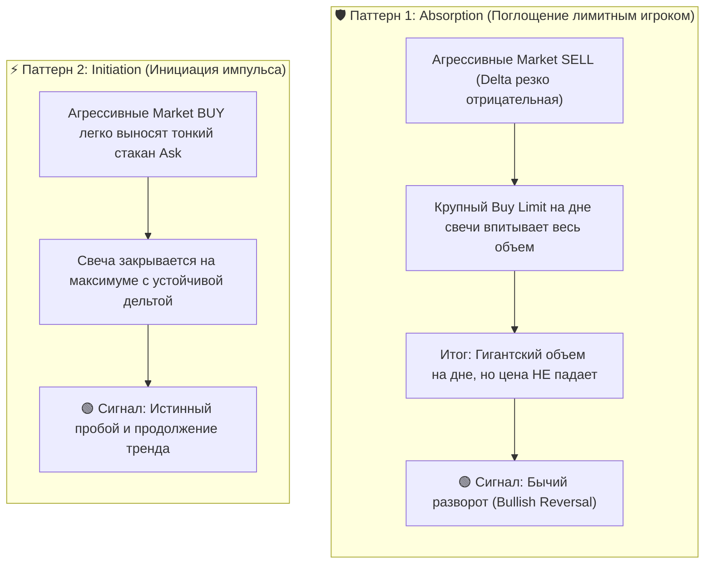

+++
title = "Order Flow, Footprint и CVD в алготрейдинге: физика ликвидности и чтение микроструктуры рынка"
date = 2026-10-08
description = "Глубокий разбор механики биржевого потока ордеров (Order Flow): взаимодействие Market и Limit заявок, чтение Footprint, расчет CVD и выявление паттернов Absorption."
[taxonomies]
tags = ["algo-trading", "order-flow", "quantitative", "market-microstructure", "architecture"]
[extra]
toc = true
+++

Большинство розничных трейдеров и начинающих квант-разработчиков смотрят на рынок через призму **свечей (OHLCV)** и производных индикаторов (RSI, MACD, скользящие средние). Главная проблема такого подхода — **запаздывание и потеря информации**. 

Свеча фиксирует только финальный результат интервала времени, скрывая главное: *какие объемы, по каким ценам и с какой агрессией проторговывались внутри бара*.

**Order Flow (поток ордеров)** — это фундаментальная физика биржи. Это регистрация реального взаимодействия между покупателями и продавцами в режиме реального времени.

Разберем, как устроена биржевая ликвидность, как читать кластерный график (**Footprint**), интерпретировать накопленную дельту (**CVD**) и формализовать эти сигналы в алгоритмических стратегиях.

---

## 1. Физика рынка: Market vs Limit ордера в биржевом стакане (DOM)

Рыночная цена не движется сама по себе — ее двигает исключительно дисбаланс между агрессивными и пассивными заявками в **Depth of Market (DOM)**:

| Сторона стакана | Ценовой уровень | Доступный объем | Роль участника |
| :--- | :---: | :---: | :--- |
| 🔴 **ASK (Sell Limit)** | `$65,010` | `12.5 BTC` | Пассивный продавец |
| 🔴 **ASK (Sell Limit)** | `$65,005` | `8.0 BTC` | Пассивный продавец |
| 🔴 **ASK (Sell Limit)** | `$65,000` | `4.2 BTC` | Best Ask (ближайшая ликвидность) |
| ⚡ **SPREAD** | — | — | **Market BUY** выкупает ликвидность Ask |
| 🟢 **BID (Buy Limit)** | `$64,995` | `5.1 BTC` | Best Bid (ближайшая поддержка) |
| 🟢 **BID (Buy Limit)** | `$64,990` | `10.0 BTC` | Пассивный покупатель |
| 🟢 **BID (Buy Limit)** | `$64,985` | `15.4 BTC` | Пассивный покупатель |

### Ключевые аксиомы микроструктуры:
1. **Limit Orders (Пассивные):** добавляют ликвидность в стакан. Они формируют уровни поддержки/сопротивления и ждут, пока в них исполнятся другие участники.
2. **Market Orders (Агрессивные):** забирают ликвидность из стакана. Только рыночные ордера двигают цену, «выедая» лимитные заявки на противоположной стороне.
3. **Deep vs Shallow Market:** на глубоком рынке крупный рыночный ордер сдвинет цену незначительно; на тонком (неликвидном) рынке даже средний объем пробьет несколько ценовых уровней (проскальзывание / slippage).

---

## 2. Volume Footprint: кластерный рентген свечи

**Footprint** разбивает каждую свечу на ценовые уровни и показывает объем сделок, совершенных по цене **Bid** (агрессивные продажи) и по цене **Ask** (агрессивные покупки):

| Уровень цены | Bid (Market Sell) | Ask (Market Buy) | Delta ($\Delta$) | Рыночная структура |
| :---: | :---: | :---: | :---: | :--- |
| **$65,020** | `12` | `85` | `+73` | 🟢 **Stacked Buying Imbalance** |
| **$65,015** | `5` | `42` | `+37` | 🟢 **Stacked Buying Imbalance** |
| **$65,010** | `18` | `90` | `+72` | 🟢 **Агрессор пробивает уровень** |
| **$65,005** | `50` | `48` | `-2` | Нейтральный баланс |
| **$65,000** | `120` | `110` | `-10` | 🔵 **Point of Control (POC / макс. объем)** |

### Что дает Footprint:
* **Delta ($\Delta$):** разница между покупками по Ask и продажами по Bid на конкретной цене:
  $$\Delta = \text{Volume}\_{\text{Ask}} - \text{Volume}\_{\text{Bid}}$$
* **Stacked Imbalance (Стек дисбалансов):** ситуация, когда 3 и более ценовых уровня подряд показывают многократный перевес покупателей или продавцов (обычно от 300% до 400%). Это маркер сильного импульса.

---

## 3. Два ключевых паттерна: Absorption vs Initiation

При анализе Footprint алгоритм ищет два фундаментальных состояния рынка:



---

## 4. CVD (Cumulative Volume Delta) и дивергенции

**CVD (накопленная дельта объема)** суммирует дельту всех совершенных сделок с начала сессии или расчетного окна:

$$\text{CVD}\_t = \sum\_{i=1}^{t} \Delta\_i = \sum\_{i=1}^{t} (\text{Vol}\_{\text{Ask}, i} - \text{Vol}\_{\text{Bid}, i})$$

### Дивергенции CVD как индикатор истощения:
- **Медвежья дивергенция (Bearish Absorption):** цена обновляет локальный максимум (Higher High), но CVD формирует более низкий максимум (Lower High) или резко падает. Это означает, что рост идет на тонком рынке без поддержки реальных покупок.
- **Бычья дивергенция (Bullish Absorption):** цена обновляет минимум (Lower Low), а CVD растет (Higher Low). Агрессивные продажи упираются в скрытые лимитные заявки крупного покупателя.

---

## 5. Volume Profile: POC, Value Area, HVN и LVN

В то время как классический объем привязан к времени (Volume per Bar), **Volume Profile** группирует объем по горизонтальным ценовым уровням (Volume at Price):

| Ценовой уровень | Профиль объема | Тип зоны | Структура ликвидности |
| :---: | :--- | :---: | :--- |
| **$65,030** | `█` | **LVN** | Зона быстрого пролета (тонкая ликвидность) |
| **$65,020** | `██████` | **VA** | Value Area (торговля в балансе) |
| **$65,010** | `████████████████████` | **POC / HVN** | **Point of Control (максимальное принятие цены)** |
| **$65,000** | `██████████` | **VA** | Value Area (торговля в балансе) |
| **$64,990** | `█` | **LVN** | Зона отторжения цены |

| Уровень | Описание | Торговый смысл |
| :--- | :--- | :--- |
| **POC (Point of Control)** | Ценовой уровень с максимальным объемом за период. | Служит «магнитом» для цены и сильным уровнем ретеста. |
| **Value Area (VA)** | Диапазон цен, в котором прошло ~70% всего объема. | Торговля внутри VA = баланс; выход за границы VA = направленный импульс. |
| **HVN (High Volume Node)** | Узлы высокой плотности объема. | Зоны консолидации и принятия справедливой цены. |
| **LVN (Low Volume Node)** | Узлы низкой плотности объема. | Уровни неликвидности, которые цена проскакивает с высокой скоростью. |

---

## 6. Алгоритмическая реализация: расчет Delta и CVD на Python

Для количественных бэктестов и торговых ботов поток тиков (*Trade Prints / Time & Sales*) агрегируется по тиковым флагам (`is_buyer_maker`):

```python
import pandas as pd
import numpy as np

def calculate_order_flow_metrics(trades_df: pd.DataFrame) -> pd.DataFrame:
    """
    Расчет дельты и CVD по потоку тиковых сделок биржи.
    trades_df содержит: ['timestamp', 'price', 'quantity', 'is_buyer_maker']
    """
    # Если сделка совершена по инициативе покупателя (buyer is taker), это покупка по Ask
    # Если is_buyer_maker == True, значит покупатель выставил лимит, а продавец ударил по рынку (Sell)
    trades_df['is_buy'] = ~trades_df['is_buyer_maker']
    
    trades_df['buy_vol'] = np.where(trades_df['is_buy'], trades_df['quantity'], 0.0)
    trades_df['sell_vol'] = np.where(~trades_df['is_buy'], trades_df['quantity'], 0.0)
    trades_df['delta'] = trades_df['buy_vol'] - trades_df['sell_vol']
    
    # Расчет кумулятивной дельты (CVD)
    trades_df['cvd'] = trades_df['delta'].cumsum()
    
    # Агрегация по 1-минутным барам
    bars = trades_df.resample('1min', on='timestamp').agg({
        'price': ['first', 'max', 'min', 'last'],
        'quantity': 'sum',
        'buy_vol': 'sum',
        'sell_vol': 'sum',
        'delta': 'sum',
        'cvd': 'last'
    })
    
    return bars
```

---

## Ключевые выводы

1. **Цену двигают только агрессивные заявки:** рыночные покупки бьют по лимитным продажам (Ask), рыночные продажи — по лимитным покупкам (Bid).
2. **Footprint дает опережающий сигнал:** паттерны *Absorption* (поглощение) на ключевых уровнях позволяют заходить в позиции до того, как индикаторы успеют отреагировать.
3. **CVD выявляет манипуляции и истощение:** расхождение между движением цены и накопленной дельтой защищает от ложных пробоев.
4. **Volume Profile очерчивает карту боя:** POC и границы Value Area (VA) служат математически обоснованными таргетами для фиксации прибыли и выставления защитных стоп-приказов.

---

## Первоисточники и материалы

* **Автор курса и видеоматериал:** [Mind Math Money — MASTER Order Flow Trading (Complete Guide)](https://youtu.be/Rqu-AoD9BUo)
* **Детальный конспект и cheat-sheet в базе знаний:** [Obsidian Vault: Order Flow Course Notes (GitHub)](https://github.com/xsa-dev/obsidian-vault/blob/main/YouTube/Order-Flow-Trading-Course-MindMathMoney-2026.md)
* **Количественные репозитории:** [github.com/xsa-dev](https://github.com/xsa-dev)
