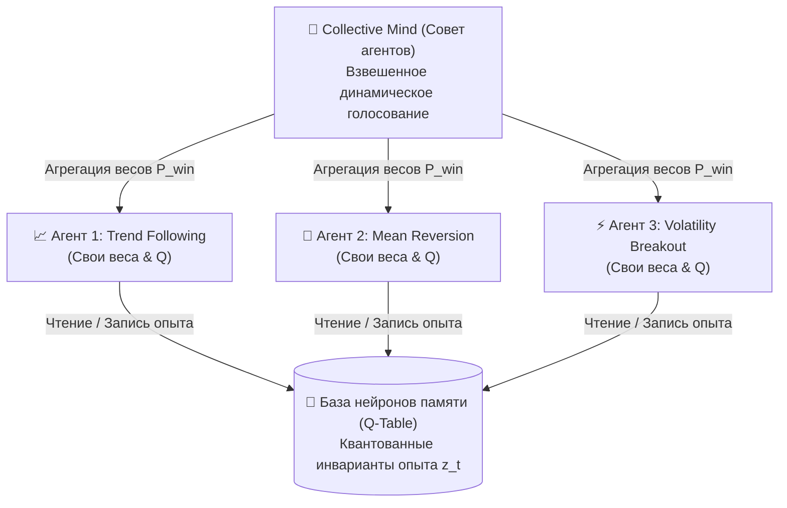

+++
title = "Reinforcement Learning в алготрейдинге: архитектура памяти состояний, Q-learning и стационарные признаки"
date = 2026-10-07
description = "Инженерный разбор RL-систем для финансовых рынков: квантование состояний в нейроны памяти, z-score инварианты, Q-learning и ансамблевый Collective Mind."
[taxonomies]
tags = ["algo-trading", "reinforcement-learning", "machine-learning", "architecture", "quantitative"]
+++

Большинство попыток применить классическое машинное обучение (Supervised Learning) к финансовым рынкам разбиваются об одну фундаментальную проблему — **нестационарность временных рядов**. Рыночный режим меняется, скользящие средние смещаются, а обученная на исторических ценах «монолитная» нейросеть начинает генерировать ложные сигналы.

Вместо монолитных «черных ящиков» в количественном трейдинге все чаще применяются **иерархические системы обучения с подкреплением (Reinforcement Learning)** на основе дискретной памяти состояний и стационарных признаков.

Разберем архитектуру такого контура: от квантования рыночного опыта в «нейроны памяти» до взвешенного ансамблевого голосования (*Collective Mind*).

---

## 1. Иерархическая архитектура: от нейрона к ансамблю

Вместо одной сложной модели строится трехуровневая модульная иерархия:



1. **Нейрон памяти (Memory Neuron):** элементарная единица опыта. Хранит квантованный ключ рыночной ситуации, предпринятое действие ($a \in \{\text{Buy}, \text{Sell}, \text{Hold}\}$), текущую $Q$-оценку, счетчик посещений и возраст записи.
2. **Специализированный агент:** независимый модуль логики со своим фокусом (краткосрочный импульс, спред, фильтр волатильности).
3. **Collective Mind (Коллективный разум):** управляющий контур, объединяющий решения агентов через взвешенное голосование, где вес каждого агента динамически пропорционален его исторической точности ($P_{\text{win}}$).

---

## 2. Стационарные признаки: инвариантность к уровню цен

Сырые цены закрытия и абсолютные индикаторы нестационарны. Если обучить модель на Bitcoin по $30,000, при цене $90,000 ее веса потеряют физический смысл.

Решение — переход к **стационарным z-score инвариантам**:

$$z\_t = \frac{p\_t - \mu\_{\text{SMA}(k)}}{\sigma\_{\text{StdDev}(k)}}$$

Вектор состояния описывает не *«где находится цена»*, а *«форму и аномалию движения»* относительно локальной волатильности. Далее непрерывные значения квантуются в дискретные интервалы (бины). Например:
* $z\_{\text{RSI}} \in \{\text{Oversold}, \text{Neutral}, \text{Overbought}\}$
* $z\_{\text{Spread}} \in \{\text{Tight}, \text{Normal}, \text{Wide}\}$

Благодаря квантованию пространство состояний сжимается с бесконечности до сотен тысяч обозримых ситуаций, которые накапливают статистический опыт.

---

## 3. Математика Q-Learning и балансировка редких классов

Обновление оценок ценности действия строится по уравнению Беллмана:

$$Q(s, a) \leftarrow Q(s, a) + \alpha \cdot \left[ r + \gamma \cdot \max\_{a'} Q(s', a') - Q(s, a) \right]$$

где:
* $\alpha$ — скорость обучения (learning rate);
* $\gamma$ — фактор дисконтирования будущих наград;
* $r$ — немедленная рыночная награда (PnL с поправкой на проскальзывание и комиссию).

```python
# Концептуальная логика обновления нейрона памяти
class MemoryNeuron:
    def __init__(self, state_key, action):
        self.state_key = state_key
        self.action = action
        self.q_value = 0.0
        self.visits = 0
        self.last_seen = 0

    def update(self, reward, next_max_q, alpha=0.1, gamma=0.95):
        # Балансировка: редкие состояния обновляются с повышенным весом
        effective_alpha = alpha / (1.0 + 0.01 * self.visits)
        td_target = reward + gamma * next_max_q
        self.q_value += effective_alpha * (td_target - self.q_value)
        self.visits += 1
```

> **Борьба с дисбалансом классов:** на рынке 70%+ времени идет боковик. Без балансировки редкие ситуации разворота тренда просто не успеют набрать статистику. Взвешивание через счетчик посещений позволяет системе адекватно оценивать редкие критические режимы.

---

## 4. Pruning памяти и адаптивный Exploration

Чтобы база нейронов памяти не раздувалась, применяются два механизма:
1. **Pruning (Отсечение):** нейроны с околонулевыми счетчиками посещений за длительный период или стабильно отрицательным $Q$ удаляются, освобождая память и очищая стратегию от устаревших аномалий.
2. **Эволюционный $\varepsilon$-Greedy:** в спокойные периоды система эксплуатирует накопленный опыт ($\varepsilon \to 0$), а при резких скачках волатильности (режим сменился) уровень исследования повышается.

---

## Ключевые выводы

- **Квантование + z-score** превращают нестационарные рыночные котировки в долговечные признаки.
- **Иерархия (Память → Агенты → Совет)** защищает от сбоев отдельных стратегий за счет взвешенного ансамбля.
- **Детерминированный Q-learning** на понятных состояниях прозрачнее и устойчивее к оверфиттингу, чем глубокие черные ящики.

---

## Первоисточники и материалы

* **Автор исследования:** Yevgeniy Koshtenko (MQL5 / MetaTrader 5 Research)
* **Заметки и детальный конспект статьи:** [Obsidian Vault: RL System AlgoTrading (GitHub)](https://github.com/xsa-dev/obsidian-vault/blob/main/Articles/RL-System-AlgoTrading-MQL5-RU.md)
* **Количественные репозитории:** [github.com/xsa-dev](https://github.com/xsa-dev)
