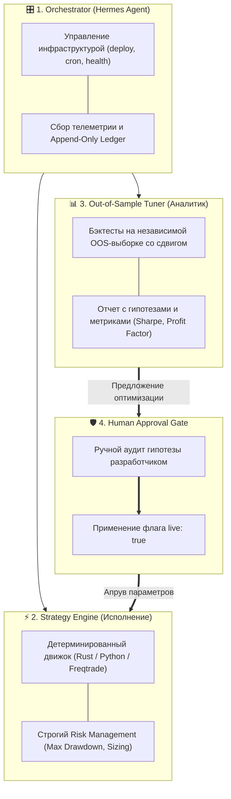

+++
title = "Самообучающиеся торговые AI-агенты: иллюзии, оверфиттинг и реальная архитектура"
date = 2026-10-07
description = "Разбор архитектуры self-improving trading agents: почему обещания 40%+ в месяц — это маркетинг, и как на самом деле строить надежные контуры с OOS-тюнингом и approval gates."
[taxonomies]
tags = ["ai-agents", "algo-trading", "architecture", "mlops"]
+++

Концепция автономного торгового агента, который «сам торгует, анализирует свои ошибки и дообучает стратегию 24/7», сейчас на пике хайпа. В сети появляется множество видео и промптов, обещающих превратить Claude Code или LLM-агентов в машины по генерации сверхприбыли.

Однако между красивыми демо-роликами и реальным рыночным продакшном лежит огромная пропасть. Разберем, где здесь маркетинг, где критические риски оверфиттинга, и как должна выглядеть архитектура надежного агентного контура.

---

## Анатомия хайпа: 47% в месяц и «научный метод»

Типичный сценарий, который продвигают в платном доступе:
1. One-shot prompt для Claude Code разворачивает стек на Railway / облаке.
2. Агент подключается к API биржи и ведет позиции.
3. Еженедельно агент анализирует ledger (историю сделок) и меняет веса стратегии.
4. Заявляются цели уровня 40–50% в месяц при минимальных просадках.

### В чем фундаментальные проблемы такого подхода?

* **Статистическая незначимость:** демонстрация «24 прибыльных / 22 убыточных сделки за 8 недель» — это околонулевая выборка. В алготрейдинге статистический edge проявляется на выборках от 500–1000+ сделок на разных рыночных режимах.
* **Иллюзия «одной переменной»:** в классическом научном методе гипотезы тестируют, меняя один параметр. В реальной мульти-активной стратегии десятки гиперпараметров (stop-loss, take-profit, regime threshold, ATR multiplier) жестко скоррелированы. LLM, пытаясь подогнать один параметр под прошлую неделю, гарантированно переобучается на локальный шум (in-sample overfitting).
* **Слепое доверие переключению в Live:** делегировать агенту право самостоятельно переключать флаг `live: true` без внешнего бэктеста и человека — прямой путь к ликвидации депозита.

---

## Архитектура надежного контура

Если отбросить маркетинговую шелуху, сама идея разделения обязанностей между специализированными агентами вполне жизнеспособна. Но архитектура должна строиться по принципу **изолированных контуров и жестких шлюзов (Approval Gates)**:

---

## 4 ключевых принципа для продакшна

### 1. Детерминированное исполнение отдельно от LLM
LLM не должна принимать решения по каждой свече на миллисекундах. Роль AI-агента — **мета-оптимизация и аналитика**: генерация идей, фильтрация аномалий, валидация гипотез. Исполнение ордеров и контроль рисков должны выполняться жестким детерминированным кодом.

### 2. Append-Only Ledger как единственный источник правды
Все события, котировки, сигналы и фактические исполнения логируются в неизменяемый JSONL-лог. Агент не может переписать историю — только прочитать ее.

### 3. Out-of-Sample валидация со сдвигом по времени
Тюнер стратегий никогда не должен оптимизировать параметры на тех же данных, где искались сигналы. Использование временного сдвига (например, 3–7 дневный лаг) защищает от оптимизации под случайные всплески волатильности.

### 4. Human-in-the-loop (Ручной шлюз)
Любые изменения в `strategy.yaml` или параметрах риск-менеджмента требуют явного подтверждения человеком. Переход `paper → live` выполняется только после прохождения OOS-гейта.

---

## Первоисточники и материалы

* **Оригинальное видео:** [01 Systems (Wacko Alpha) — Self-Improving Trading Agent on YouTube](https://youtu.be/6njREUQAFdg)
* **Заметки и детальный конспект:** [Obsidian Vault: Self-Improving Trading Agent (GitHub)](https://github.com/xsa-dev/obsidian-vault/blob/main/YouTube/Self-improving-trading-agent-Hermes-2026-06-21.md)
* **Инженерные наработки и репозитории:** [github.com/xsa-dev](https://github.com/xsa-dev)
