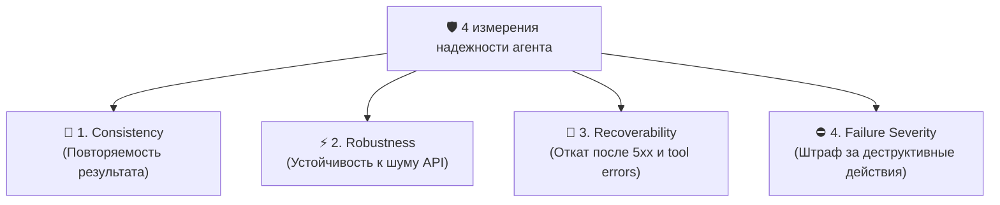
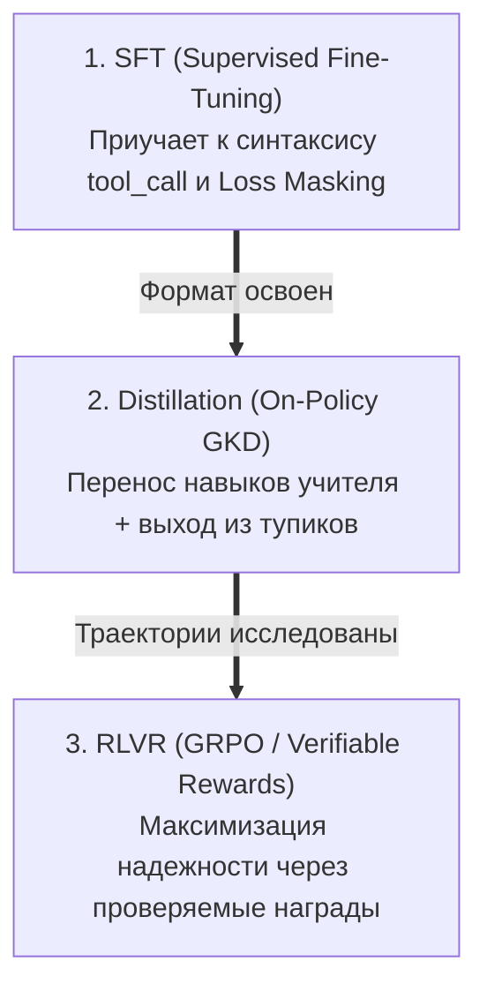

+++
title = "Как обучать и оценивать AI-агентов: почему Pass@1 бесполезен и как работает связка SFT + GKD + GRPO"
date = 2026-10-07
description = "Инженерный разбор пост-тренинга и бенчмаркинга AI-агентов: от маскирования loss в SFT и on-policy дистилляции до RLVR (GRPO) и изолированных сред."
[taxonomies]
tags = ["ai-agents", "machine-learning", "reinforcement-learning", "evals", "mlops"]
+++

Большинство метрик, по которым сегодня сравнивают языковые модели (вроде Pass@1 на HumanEval или статичных QA-тестах), практически бесполезны, когда дело доходит до **автономных агентов** в продакшне.

В отличие от классического чат-бота (`prompt → response`), агент — это динамическая система: **модель + обвязка (harness) + инструменты + память + мутабельное окружение + логика восстановления после ошибок**.

Разберем, из чего складывается реальная надежность агентов и как устроен современный трехуровневый пайплайн их обучения: **SFT → On-Policy Distillation (GKD) → RLVR (GRPO)**.

---

## 4 измерения надежности агента (вместо Pass@1)

Когда агент выполняет транзакционные действия (запись в БД, пуш в репозиторий, исполнение ордеров), статичный процент правильных ответов ничего не говорит о безопасности. В продакшне критичны 4 других фактора:



1. **Consistency (Повторяемость):** одна и та же задача при повторных прогонах должна давать стабильный результат с контролируемой дисперсией по токенам и времени.
2. **Robustness (Устойчивость к шуму):** мелкие изменения в формулировке, смена формата вывода CLI или незначительный шум в API не должны ломать логику рассуждений.
3. **Recoverability (Восстановление):** способность агента понять, что инструмент вернул ошибку (`404`, `SyntaxError`, пустой вывод), скорректировать гипотезу и продолжить, а не падать в бесконечный цикл.
4. **Failure Severity (Тяжесть сбоя):** синтаксическая ошибка tool call должна штрафоваться минимально, а необратимое действие (удаление таблицы или рассинхрон стейта) — приводить к жесткому блокирующему штрафу.

---

## Трехуровневый пайплайн обучения

Обучать агентов только с помощью SFT или только через RL неэффективно. Оптимальный стек пост-тренинга строится в три этапа:



### Этап 1. SFT (Supervised Fine-Tuning)
* **Цель:** научить модель синтаксису вызова инструментов (`tool_calls`), структуре системных инструкций и multi-turn диалогу.
* **Критический нюанс — Loss Masking:** градиентный спуск должен рассчитываться **только** на токенах генерации агента (thought + action). Обучать модель предсказывать вывод терминала, ответ пользователя или результат исполнения инструмента — грубая ошибка. Токены окружения маскируются значением `-100`.
* **Потолок SFT:** модель становится идеальным имитатором обучающего датасета, но не умеет исследовать новые пути или исправлять свои ошибки.

### Этап 2. On-Policy Distillation (GKD / Generalized Knowledge Distillation)
Классическая дистилляция (Off-Policy) подает студенту идеальные траектории учителя-гиганта. В реальности маленькая модель неизбежно ошибается, попадает в незнакомое состояние и «галлюцинирует» (exposure bias).

* **Решение — On-Policy GKD:** студент **сам генерирует траекторию**, а модель-учитель оценивает логиты именно в тех промежуточных состояниях, куда студент реально зашел.
* Использование **Reverse KL** заставляет студента фокусироваться на главных модах распределения учителя и учит выходить из тупиков.

### Этап 3. RLVR и GRPO (Reinforcement Learning with Verifiable Rewards)
Когда формат закреплен, в дело вступает обучение с подкреплением по проверяемому результату. **GRPO (Group Relative Policy Optimization)** убирает необходимость в отдельной тяжелой модели-критике (Critic Network):

1. На один входной промпт генерируется группа из $G$ вариантов ($G = 8..16$).
2. Каждый вариант прогоняется через детерминированный верификатор (тесты, компилятор, линтер).
3. Награда нормализуется внутри группы: $A_i = \frac{r_i - \text{mean}(R)}{\text{std}(R)}$.

```python
# Концептуальная схема многокомпонентной награды
def calculate_agent_reward(trajectory, test_result):
    return (
        0.2 * format_reward(trajectory)       # Валидный JSON / tool schema
        + 0.6 * execution_reward(test_result) # Unit-тесты пройдены
        + 0.2 * efficiency_reward(trajectory) # Минимальное число шагов
    )
```

> **Правило дисперсии:** GRPO работает только при наличии вариативности наград. Если все 8 вариантов провалились или все 8 выполнились успешно — обучающий сигнал равен нулю. Задача тренера — подбирать задачи на «границе возможностей» модели.

---

## Главный анти-паттерн: Reward Hacking

Если верификатор наград слаб (например, оценивает только наличие ключевого слова в выводе), RL-агент моментально найдет шорткат: научится вызывать заглушку `exit(0)` или обходить тесты.

Грейдер должен быть **физически изолирован** от среды агента (отдельный контейнер / процесс), а валидация обязана проверять фактический граф мутаций файловой системы и БД.

---

## Ключевые выводы

- **Агент = Модель + Среда:** оценивайте не LLM в изоляции, а всю замкнутую систему действий.
- **SFT дает форму, GKD учит исправлять ошибки, RL находит оптимум.**
- **Трейсы продакшна — топливо для тестов:** каждая непредвиденная ошибка агента в бою должна автоматически превращаться в изолированный тест для пост-тренинга.

---

## Первоисточники и материалы

* **Оригинальная серия воркшопов:** [Hugging Face — Training and Evaluating AI Agents (YouTube Playlist)](https://youtube.com/playlist?list=PLo2EIpI_JMQvQZm-kVlz4wY1vWF0LBcf5)
* **Детальный структурированный конспект:** [Obsidian Vault: Training & Evaluating AI Agents (GitHub)](https://github.com/xsa-dev/obsidian-vault/blob/main/YouTube/Training-and-Evaluating-AI-Agents-Workshop-Series-2026-09-16.md)
* **Репозитории и код:** [github.com/xsa-dev](https://github.com/xsa-dev)
